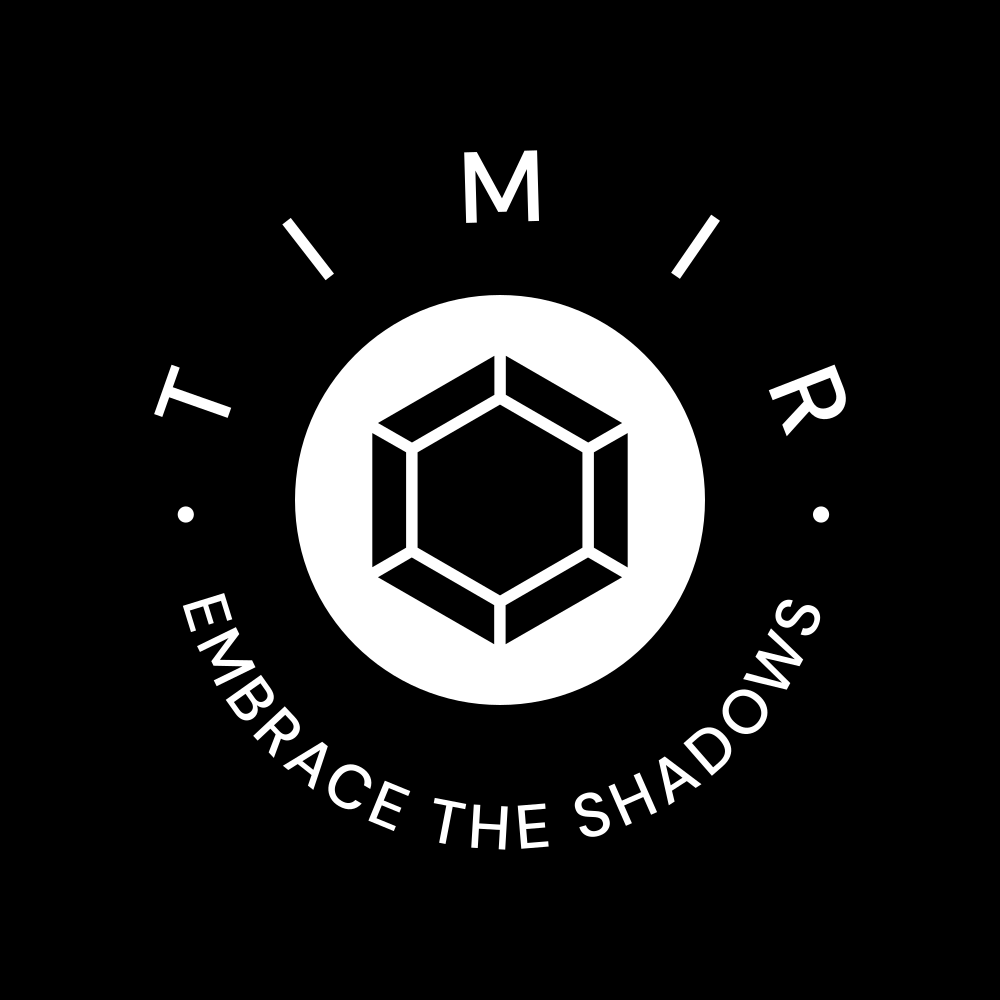

  

<h1 align="center">
  Timir : Embrace the Shadows
</h1>

  A minimal, Maastricht Blue dark theme for Visual Studio Code.

  
  
  
  

Timir is a visually striking dark theme for Visual Studio Code that provides an immersive coding experience. Inspired by the Sanskrit word "Timir" meaning darkness, this theme aims to create a sleek and elegant environment for developers who prefer a darker color scheme.

## Features

- **Rich Color Palette:** Timir features carefully selected colors that enhance code readability and reduce eye strain during long coding sessions.
- **Syntax Highlighting:** The theme offers syntax highlighting for a wide range of programming languages and file types, ensuring a consistent and visually appealing experience across different coding environments.
- **Contrast and Balance:** Timir strikes a fine balance between the vibrant syntax colors and the subdued background, providing excellent contrast and making your code stand out.
- **Easy on the Eyes:** Designed with focus and comfort in mind, Timir optimizes the color combinations to minimize eye fatigue and improve overall readability.

## Installation

1. Launch Visual Studio Code.
2. Go to the Extensions view by clicking on the square icon in the left sidebar or pressing `Ctrl+Shift+X`.
3. Search for "Timir Dark Theme".
4. Click **Install** to install the theme.
5. Once installed, click **Reload** to activate the theme.
6. Open the **Command Palette** (`Ctrl+Shift+P` or `Cmd+Shift+P` on macOS) and select **Preferences: Color Theme**.
7. Choose **Timir Dark** from the list of available themes.

## Contributing

Contributions are welcome! If you encounter any issues or have suggestions for improvements, please feel free to [open an issue](https://github.com/Biotechnologyguy/Timir-VSCode/issues) or submit a pull request.

## Feedback and Support

Your feedback is valuable! If you have any questions, feedback, or need support, you can reach out to me via [founder@biotechnologyguy.com](mailto:founder@biotechnologyguy.com) or [create an issue](https://github.com/Biotechnologyguy/Timir-VSCode/issues).

## License

This theme is released under the [MIT License](LICENSE).

Enjoy coding with Timir Dark Theme!

